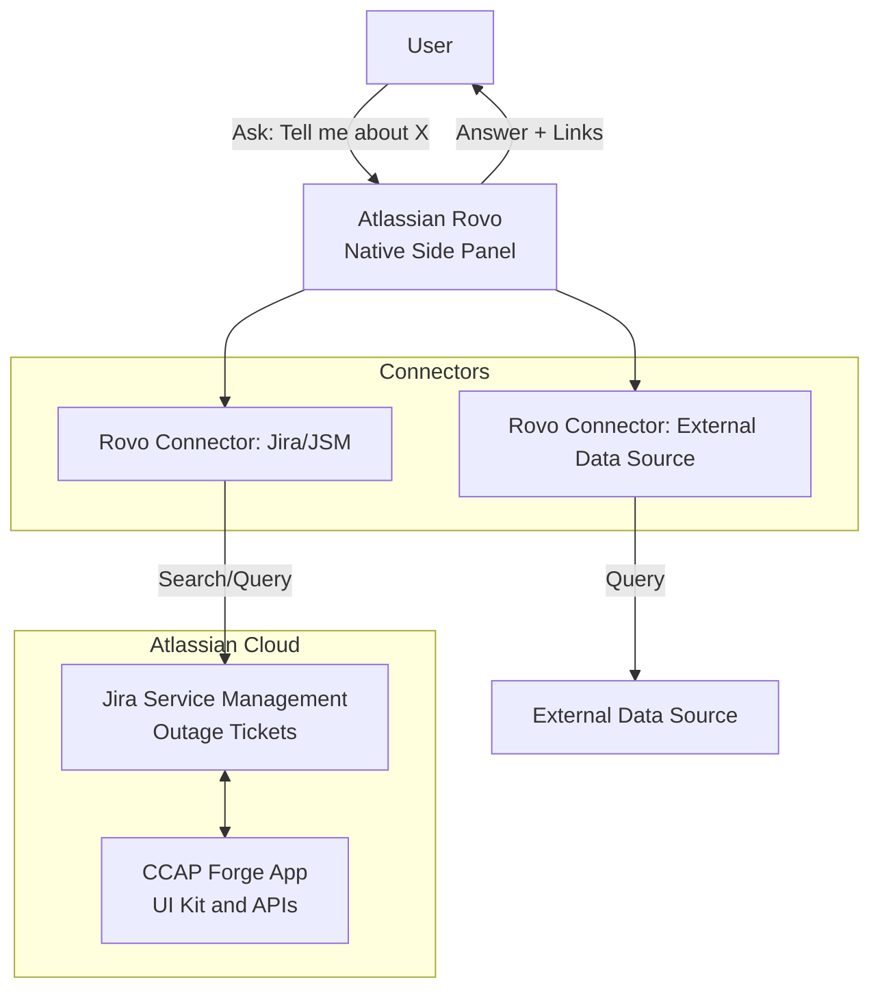
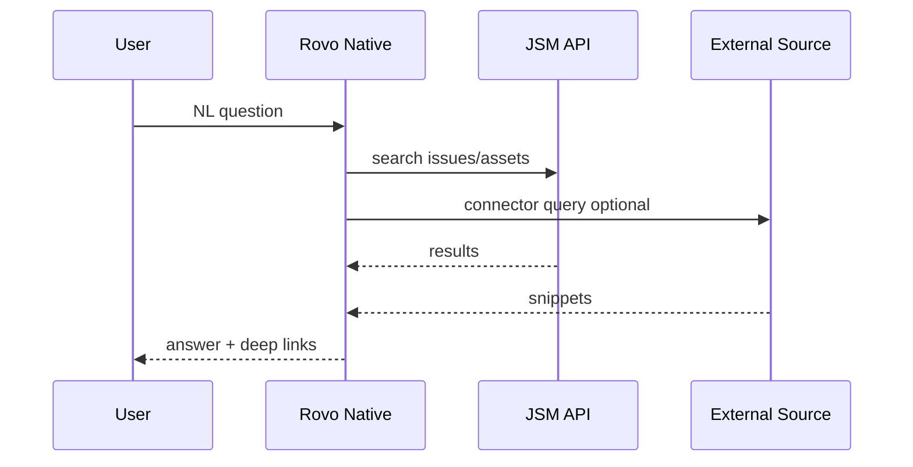
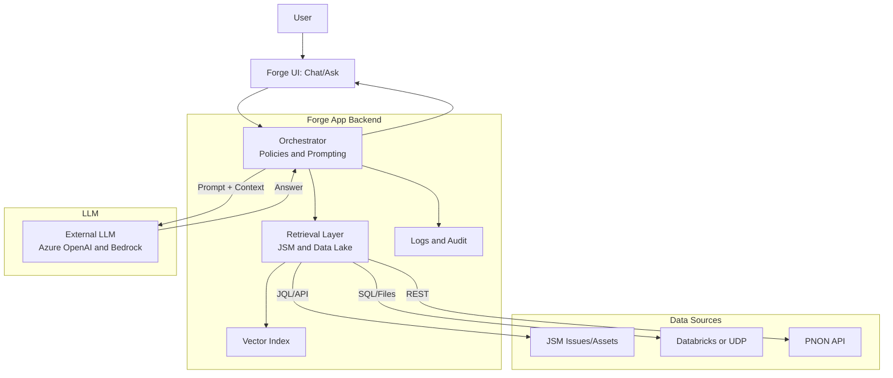
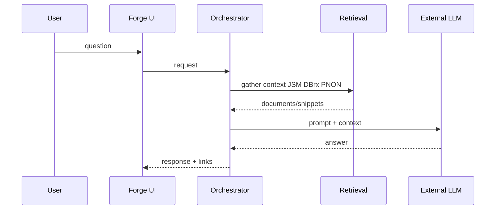
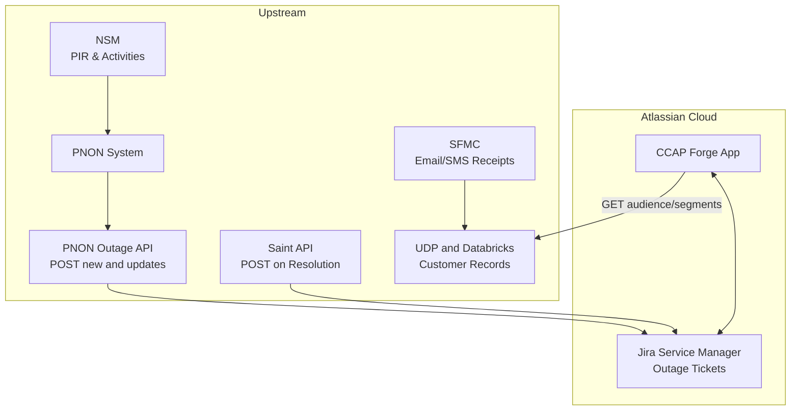
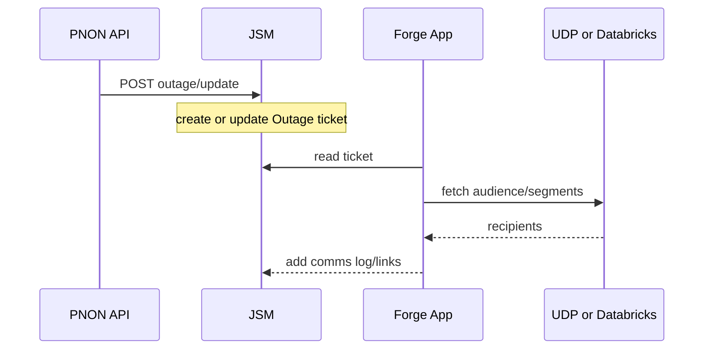
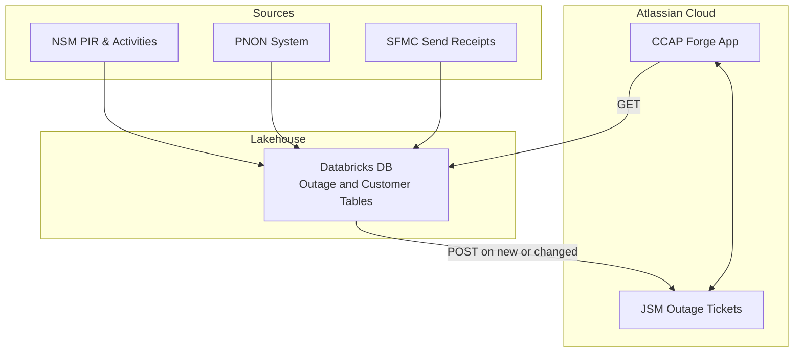

# Architecture Options (Text-Based Diagrams)

This file contains Mermaid diagrams (text-based) for the four options so you can copy/export to PPTX or PNG.

---

## AI Option 1 – Rovo Native

Notes
- Strengths: fastest path; governance native; no app hosting. 
- Limits: UX bound to Rovo panel; customization of retrieval/ranking limited to connectors.

Sequence optional

---

## AI Option 2 – External LLM Custom

Notes
- Strengths: full control over UX, retrieval, guardrails, and data residency. 
- Consider: token/PII governance, cost controls, latency.

Sequence optional

---

## Data Layer Option 1 – JSM fed from PNON/UDP

Notes
- Pros: leverages existing UDP/PNON; minimal new infra.
- Cons: dependencies on upstream integration teams; data freshness varies by feed.

Sequence optional

---

## Data Layer Option 2 – Databricks-backed JSM

Notes
- Pros: single curated store; easier joins and analytics; good for RAG.
- Cons: adds a data platform to operate; initial setup effort.

---

## Export tips
- Copy any code block into https://mermaid.live to export PNG/SVG/PDF.
- Or install Mermaid CLI locally to export from this file.
